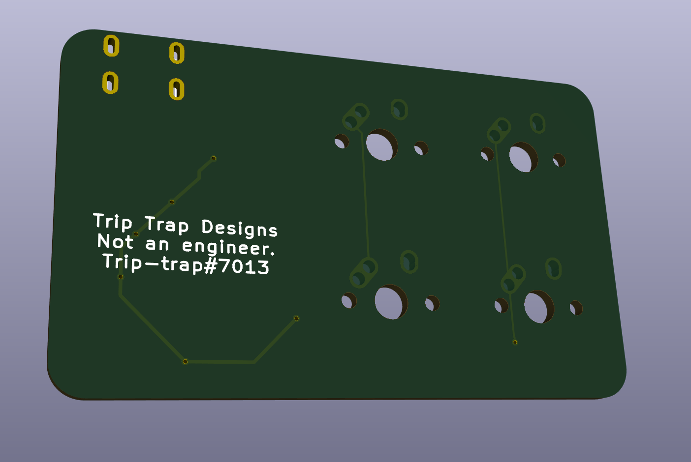
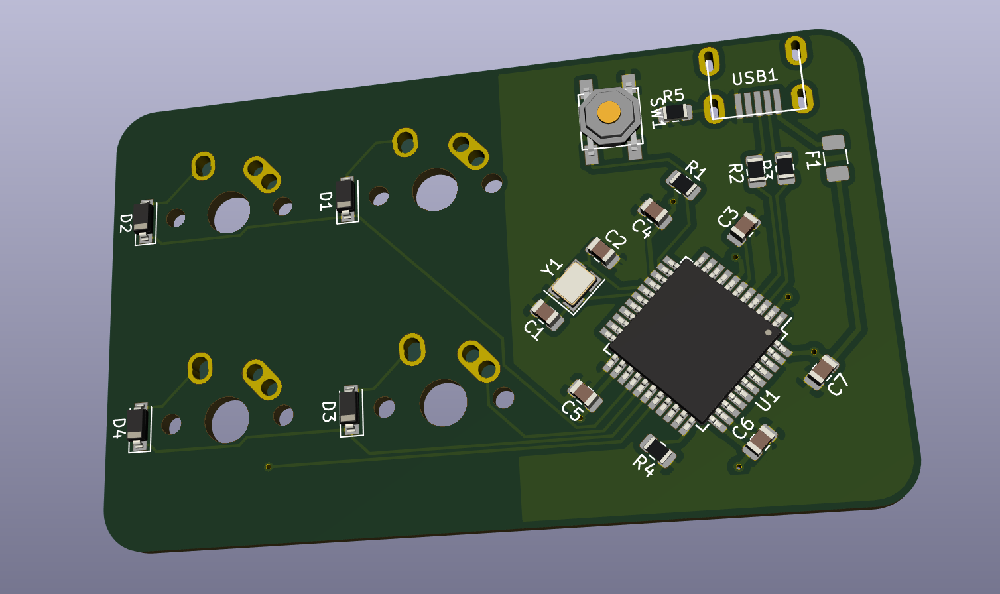

# Trip-traps's Business card

A simple little macro pad, made by following ai03's guide: 

This is my first attempt at designing a pcb so it it is mostly a learning opportunity for me, therefore it doesn't do anything fancy.
